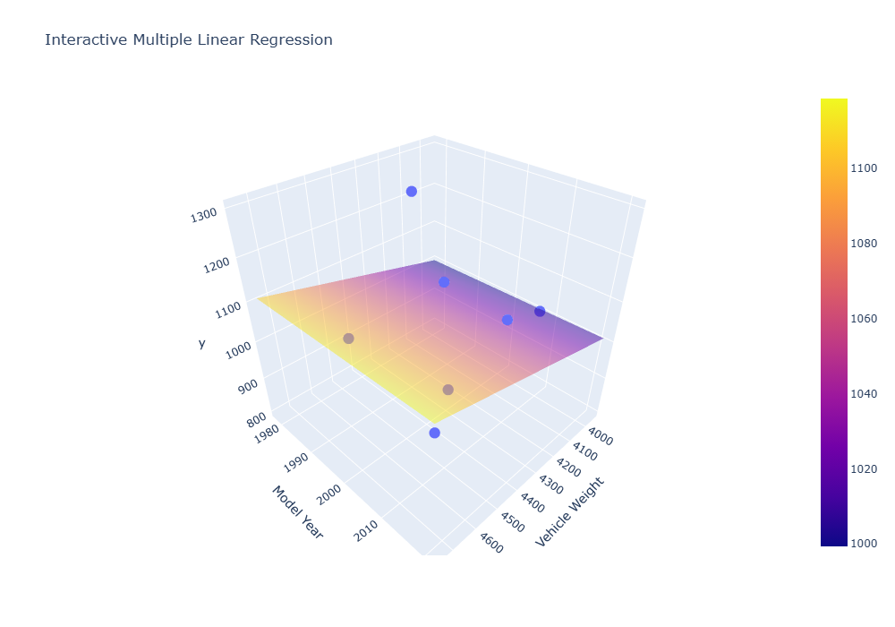

# Machine Learning Zoomcamp 2026 — Homework 01

> A hands-on introduction to Machine Learning through data exploration, missing-value handling, NumPy, linear algebra, and linear regression.

This notebook contains my solution for **Machine Learning Zoomcamp 2026 — Homework 01**.

The work starts with basic dataset exploration using **Pandas** and gradually moves toward implementing **linear regression from scratch** using NumPy matrix operations.

## What This Notebook Covers

The homework is organized into seven exercises:

1. **Pandas Version**
   - Check the installed Pandas version.

2. **Records Count**
   - Load the car fuel-efficiency dataset.
   - Determine the number of records.

3. **Fuel Types**
   - Inspect the dataset columns.
   - Identify the fuel types represented in the dataset.

4. **Missing Values**
   - Count missing values across the dataset columns.

5. **Maximum Fuel Efficiency**
   - Filter the dataset to cars from Asia.
   - Find the maximum `fuel_efficiency_mpg`.

6. **Median Value of Horsepower**
   - Calculate the median of `horsepower`.
   - Find the most frequent horsepower value.
   - Fill missing horsepower values using the mode.
   - Recalculate the median and compare the result.

7. **Linear Regression with NumPy**
   - Select cars from Asia.
   - Use `vehicle_weight` and `model_year` as features.
   - Convert the first seven rows into a NumPy array.
   - Compute `X.T @ X`.
   - Invert the resulting matrix.
   - Create the target array `y`.
   - Calculate the regression weights `w`.
   - Calculate the sum of the elements of `w`.

## Dataset

The notebook uses:

`car_fuel_efficiency_2026.csv`

The dataset includes variables such as:

| Column | Description |
|---|---|
| `origin` | Origin of the car |
| `fuel_type` | Fuel type |
| `vehicle_weight` | Vehicle weight |
| `model_year` | Model year |
| `horsepower` | Horsepower |
| `fuel_efficiency_mpg` | Fuel efficiency |

## Linear Regression From Scratch

The final exercise introduces the mathematical foundation of linear regression.

The selected features are:

```text
vehicle_weight
model_year
```

The target array is:

```python
[1100, 1300, 800, 900, 1000, 1100, 1200]
```

The regression weights are calculated with:

```python
XTX = X.T @ X

XTX_inv = np.linalg.inv(XTX)

w = XTX_inv @ X.T @ y
```

The final operation is:

```python
round(w.sum(), 3)
```

This exercise connects **NumPy matrix operations** with the mathematical formulation of linear regression.

## Regression Visualization

I also created a 3D visualization of the regression result.

The visualization shows:

- `vehicle_weight` on the X-axis
- `model_year` on the Y-axis
- `y` on the Z-axis
- Actual observations as points
- The calculated regression plane

### Preview



### Interactive Version

[Open the Interactive 3D Regression](./assets/regression_3d.html)

The interactive visualization can be rotated, zoomed, and explored directly in the browser.

## Tools Used

- Python
- Pandas
- NumPy
- Plotly
- Jupyter Notebook
- Google Colab

## Repository Structure

```text
01_Introduction/
│
├── HW_01_RayhanAbdulFikri.ipynb
├── introduction.md
│
└── assets/
    ├── car_fuel_efficiency_2026.csv
    ├── interactive-multiple-linear-regression.png
    └── regression_3d.html
```

## Learning Focus

The main concepts practiced in this homework are:

```text
Data Loading
    ↓
Data Exploration
    ↓
Filtering
    ↓
Missing-Value Handling
    ↓
NumPy Arrays
    ↓
Matrix Multiplication
    ↓
Matrix Inversion
    ↓
Linear Regression
    ↓
3D Visualization
```

## Course

**Machine Learning Zoomcamp 2026**

Homework 01:

https://courses.datatalks.club/ml-zoomcamp-2026/homework/hw01

## Author

**Rayhan Abdul Fikri**

GitHub:

https://github.com/rayhanabdulfikri/
